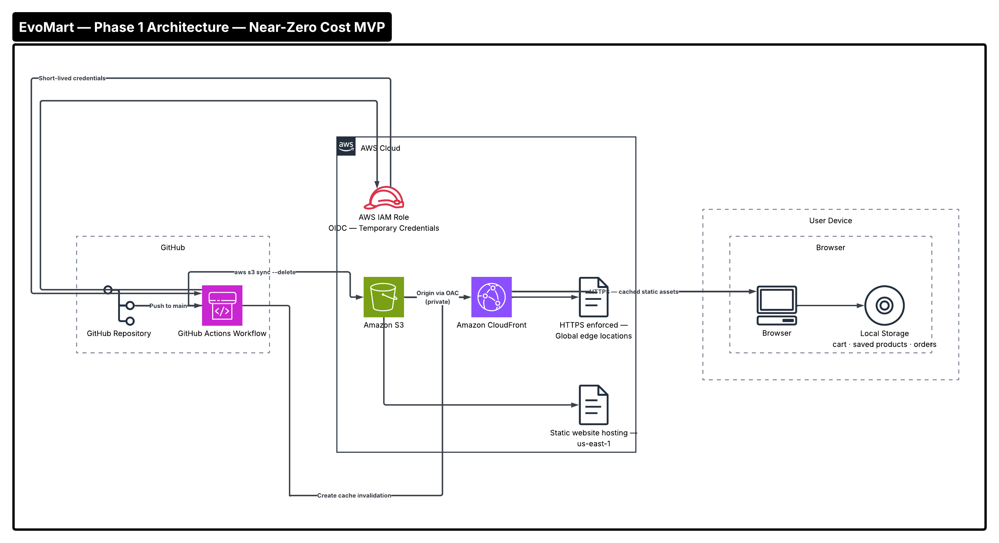

# EvoMart Phase 1 — Architecture Documentation
**Near-Zero Cost MVP**
*Last Updated: 2025 | Region: us-east-1 | Framework: Next.js + TypeScript*

---

## Table of Contents

1. [Overview](#overview)
2. [Business Context](#business-context)
3. [Goals and Success Criteria](#goals-and-success-criteria)
4. [Architecture Diagram](#architecture-diagram)
5. [Service Selection and Justification](#service-selection-and-justification)
6. [Technical Specifications](#technical-specifications)
7. [CI/CD Pipeline](#cicd-pipeline)
8. [Well-Architected Framework Alignment](#well-architected-framework-alignment)
9. [Cost Analysis](#cost-analysis)
10. [Security Considerations](#security-considerations)
11. [Limitations and Tradeoffs](#limitations-and-tradeoffs)
12. [Phase Transition Criteria](#phase-transition-criteria)

---

## Overview

EvoMart Phase 1 is a near-zero cost MVP designed to validate an e-commerce concept before committing to backend infrastructure, a database, or authentication services.

The application is a fully static Next.js site — pre-rendered at build time, hosted on Amazon S3, and distributed globally through Amazon CloudFront. All user-facing state (cart, saved products, and orders) is managed entirely in the browser using local storage. There is no server, no database, and no authentication.

This is a deliberate architectural decision, not a limitation. Phase 1 exists to answer one question: **do users want this product?** Everything else waits until that question is answered.

---

## Business Context

The startup behind EvoMart had a clear constraint entering Phase 1: validate the market without significant financial exposure.

The risks of over-engineering at this stage are well understood:

- Provisioning infrastructure for scale that may never come wastes capital
- Building authentication, databases, and backend services before validating demand adds months of unnecessary development time
- Running idle servers while waiting for users generates costs with no return
- A failed product with over-provisioned infrastructure can bankrupt a company before it ever earns revenue

Phase 1 directly addresses these risks. The architecture is designed to cost almost nothing, deploy quickly, and give real users a working experience they can respond to. Stakeholder approval and positive user feedback are the only gates to Phase 2.

**Primary stakeholders:** Startup founders, product team, early users
**Decision gate:** User feedback analysis + stakeholder sign-off before any Phase 2 investment

---

## Goals and Success Criteria

| Goal | How Phase 1 Achieves It |
|---|---|
| Validate product-market fit | Deploy a working e-commerce experience at near-zero cost |
| Minimize pre-revenue infrastructure spend | Static hosting only — no compute, no database |
| Launch quickly | Static export requires no backend setup or deployment complexity |
| Enable global access | CloudFront edge delivery from day one |
| Maintain deployment reliability | GitHub Actions CI/CD automates every deployment |
| Establish secure deployment practices | OIDC-based credential management from the start |

**Success criteria for Phase 2 progression:**
- Measurable user engagement with the product listing and cart
- Positive qualitative feedback from early users
- Formal stakeholder approval to proceed with backend investment

---

## Architecture Diagram



---

## Service Selection and Justification

### Amazon S3 — Static Website Hosting

**What it does in Phase 1:**
S3 hosts all static assets generated by the Next.js static export — HTML files, JavaScript bundles, CSS, and images. S3 static website hosting serves these files directly over HTTP.

**Why S3 over alternatives:**

| Alternative | Why Not Chosen |
|---|---|
| EC2 web server (Nginx/Apache) | Requires running compute 24/7, adds server management overhead, and costs significantly more for a pre-validation product |
| AWS Amplify Hosting | More abstraction than needed for Phase 1; adds cost and complexity |
| Vercel / Netlify | Third-party platforms introduce external dependency; keeping infrastructure on AWS maintains consistency with future phases and reduces vendor fragmentation |
| ECS / Fargate | Container orchestration is excessive for a static site with no backend |

**Why S3 is the right choice:**
- Near-zero cost for low-to-moderate traffic (S3 charges per GB stored and per request — negligible for a static MVP)
- No server management or patching
- Natively integrates with CloudFront as an origin
- Supports versioning for rollback capability
- Aligns with the AWS-native architecture used in all subsequent phases

---

### Amazon CloudFront — Global Content Distribution

**What it does in Phase 1:**
CloudFront sits in front of S3 and distributes static assets from edge locations worldwide, reducing latency for users regardless of geographic location. It also enforces HTTPS for all requests.

**Why CloudFront over alternatives:**

| Alternative | Why Not Chosen |
|---|---|
| Direct S3 URL access | No HTTPS on S3 static hosting URLs, no edge caching, higher latency for international users |
| Third-party CDN (Cloudflare, Fastly) | Introduces external dependency; CloudFront integrates natively with S3 and future AWS services (WAF, Lambda@Edge in later phases) |
| No CDN at all | Unacceptable performance for a global e-commerce product even at MVP stage |

**Why CloudFront is the right choice:**
- Significant latency reduction through global edge caching
- HTTPS enforcement with free SSL/TLS via AWS Certificate Manager
- Cache-Control header support for fine-grained asset caching
- Native S3 origin integration
- Will remain in the architecture through all four phases — no rework required

---

### GitHub Actions — CI/CD Pipeline

**What it does in Phase 1:**
GitHub Actions automates the full deployment pipeline on every push to `main` — building the static site, syncing to S3, and invalidating the CloudFront cache.

**Why GitHub Actions over AWS CodePipeline at this stage:**
AWS CodePipeline is introduced from Phase 2 onward when the infrastructure is AWS-managed end to end. In Phase 1, the only AWS resources are S3 and CloudFront — using GitHub Actions keeps the pipeline simple, free for public repositories, and avoids the cost of CodePipeline for a near-zero-cost phase.

---

### Browser Local Storage — State Management

**What it does in Phase 1:**
Cart contents, saved products, and order history are stored directly in the user's browser using the Web Storage API. No backend or database is involved.

**Why local storage over a backend:**
- Eliminates the need for any server-side infrastructure in Phase 1
- Keeps cost at near zero
- Sufficient for validating user intent and interaction patterns
- Accepted tradeoff: data does not persist across devices or browsers, which is appropriate for a pre-validation MVP

---

## Technical Specifications

### Next.js Static Export Configuration

```javascript
// next.config.js
const nextConfig = {
  output: "export",        // Enables full static HTML export
  trailingSlash: true,     // Required for S3 static hosting routing
  images: {
    unoptimized: true,     // Disables Next.js image optimization (no server available)
  },
};
```

**Why `trailingSlash: true`:**
S3 static hosting resolves paths by looking for `index.html` inside a directory. Without trailing slashes, navigating directly to `/cart` fails because S3 cannot resolve it. Trailing slashes ensure `/cart/index.html` is served correctly.

**Why `unoptimized: true` for images:**
Next.js image optimization requires a Node.js server at runtime. Since Phase 1 is a fully static export with no server, image optimization is disabled. Images are served as static files directly from S3 via CloudFront.

---

### S3 Bucket Configuration

| Setting | Value | Reason |
|---|---|---|
| Static website hosting | Enabled | Required to serve HTML files as web pages |
| Public access | Blocked (via CloudFront OAC) | S3 bucket is private; CloudFront is the only authorized origin |
| Versioning | Enabled | Allows rollback to previous deployments |
| Default root object | `index.html` | Serves homepage at the root URL |
| Region | us-east-1 | Primary region for all EvoMart phases |

**Note on bucket access:** The S3 bucket is kept private. CloudFront accesses it via **Origin Access Control (OAC)**, which is the current AWS-recommended replacement for the older Origin Access Identity (OAI). This ensures users can only access content through CloudFront — not directly via the S3 URL.

---

### CloudFront Distribution Configuration

| Setting | Value | Reason |
|---|---|---|
| Origin | S3 bucket (via OAC) | Private S3 bucket access |
| Viewer protocol policy | Redirect HTTP to HTTPS | Enforces secure connections |
| Compress objects | Enabled | Gzip/Brotli compression reduces payload size |
| Price class | PriceClass_All | Global edge coverage for maximum performance |
| Default TTL | 86400 (24 hours) | Balanced caching for static assets |
| Cache-Control (static assets) | `public, max-age=31536000, immutable` | Long-term caching for versioned JS/CSS bundles |
| Cache-Control (HTML files) | `public, max-age=0, must-revalidate` | Always revalidate HTML to ensure latest content |

**Why different cache policies for HTML vs static assets:**
Next.js generates hashed filenames for JS and CSS bundles (e.g., `_next/static/chunks/abc123.js`). Since the hash changes with every build, these files can be cached indefinitely — they will never be the same URL twice. HTML files, however, do not change their URLs between deployments, so they must always be revalidated to ensure users receive the latest version after a deployment.

---

## CI/CD Pipeline

### Pipeline Overview

```
Push to main
     │
     ▼
Checkout source (actions/checkout@v4)
     │
     ▼
Set up Node.js 18 with npm cache (actions/setup-node@v4)
     │
     ▼
Install dependencies (npm ci)
     │
     ▼
Build static site (npm run build → next build → /out directory)
     │
     ▼
Configure AWS credentials via OIDC (aws-actions/configure-aws-credentials@v4)
     │
     ▼
Sync /out to S3 bucket (aws s3 sync --delete + cache-control headers)
     │
     ▼
Invalidate CloudFront cache (aws cloudfront create-invalidation --paths "/\*")
```

### OIDC Authentication — Why No Access Keys

Phase 1 uses **OpenID Connect (OIDC)** for GitHub Actions to authenticate with AWS instead of storing long-lived `AWS_ACCESS_KEY_ID` and `AWS_SECRET_ACCESS_KEY` as repository secrets.

**How it works:**
1. GitHub Actions requests a short-lived OIDC token from GitHub's identity provider
2. AWS IAM verifies the token against the configured GitHub OIDC identity provider
3. GitHub Actions assumes the designated IAM role and receives temporary credentials (valid for the duration of the workflow run only)
4. Temporary credentials are used to sync S3 and invalidate CloudFront
5. Credentials expire automatically — nothing to rotate, nothing to leak

**Why this matters:**
Long-lived access keys are a common source of AWS security incidents. If a repository is accidentally made public, or if secrets are inadvertently logged, long-lived keys can be exploited. OIDC eliminates this attack vector entirely.

### IAM Role — Least Privilege Policy

The IAM role assumed by GitHub Actions is scoped to the minimum permissions required:

```json
{
  "Version": "2012-10-17",
  "Statement": [
    {
      "Effect": "Allow",
      "Action": [
        "s3:PutObject",
        "s3:DeleteObject",
        "s3:ListBucket"
      ],
      "Resource": [
        "arn:aws:s3:::evomart-phase1-bucket",
        "arn:aws:s3:::evomart-phase1-bucket/*"
      ]
    },
    {
      "Effect": "Allow",
      "Action": "cloudfront:CreateInvalidation",
      "Resource": "arn:aws:cloudfront::ACCOUNT_ID:distribution/DISTRIBUTION_ID"
    }
  ]
}
```

No additional permissions are granted. The role cannot read other S3 buckets, cannot modify IAM, and cannot access any other AWS service.

---

## Well-Architected Framework Alignment

### 1. Cost Optimization ✅

Phase 1 is the strongest expression of cost optimization in the entire EvoMart evolution. Every decision is driven by the principle of spending only what is necessary to achieve the current goal.

- S3 storage costs are negligible for a static site (cents per GB per month)
- CloudFront costs scale with actual user traffic — zero users means near-zero cost
- No compute resources are running idle
- No database incurs storage or I/O charges
- GitHub Actions is free for public repositories

**Estimated monthly cost at MVP scale (< 10,000 visitors/month):** under $1 USD

---

### 2. Reliability ✅

Despite its simplicity, Phase 1 benefits from strong reliability characteristics inherited from AWS managed services.

- S3 provides **99.999999999% (11 nines) durability** for stored objects
- CloudFront's global edge network means no single point of failure for content delivery
- If a CloudFront edge location fails, requests are automatically routed to the next available edge
- GitHub Actions provides automated, repeatable deployments — reducing human error

**Formal DR strategy:** Not applicable at Phase 1. S3 and CloudFront are managed, regionally resilient services. A separate DR strategy is introduced in Phase 3.

---

### 3. Security ✅

- S3 bucket is private — accessible only through CloudFront via OAC
- HTTPS enforced via CloudFront viewer protocol policy
- No long-lived credentials in CI/CD — OIDC role assumption only
- IAM role scoped to least privilege
- No user data collected or stored server-side — no data breach risk at this phase

---

### 4. Performance Efficiency ✅

- CloudFront edge caching delivers assets from the location nearest to each user
- Next.js static export produces optimized, pre-rendered HTML — no server-side rendering delay
- Gzip/Brotli compression enabled on CloudFront
- Aggressive cache-control headers on static assets minimize repeat download overhead

---

### 5. Operational Excellence ✅

- Automated CI/CD pipeline eliminates manual deployment steps
- Every deployment is version-controlled and reproducible
- CloudFront cache invalidation is automated — no manual intervention required after deployment
- S3 versioning enables rollback to any previous deployment

---

### 6. Sustainability ✅

- No continuously running compute resources consuming energy
- CloudFront edge caching reduces origin requests, lowering data transfer and energy consumption
- Serverless and static architecture minimizes resource waste during low-traffic periods

---

## Cost Analysis

### Phase 1 Cost Breakdown (Estimated)

| Service | Usage Assumption | Estimated Monthly Cost |
|---|---|---|
| S3 Storage | 500 MB static site assets | ~$0.01 |
| S3 Requests | 50,000 GET requests/month | ~$0.02 |
| CloudFront Data Transfer | 10 GB/month (< 10,000 visitors) | ~$0.85 |
| CloudFront HTTPS Requests | 100,000 requests/month | ~$0.01 |
| GitHub Actions | Public repository | Free |
| AWS Certificate Manager | SSL/TLS certificate | Free |
| **Total** | | **~$0.89 / month** |

### Cost Comparison vs Common Alternatives

| Architecture | Estimated Monthly Cost | Notes |
|---|---|---|
| EvoMart Phase 1 (S3 + CloudFront) | ~$0.89 | Near-zero cost MVP |
| EC2 t3.micro + Nginx | ~$8–$12 | Cheapest always-on server |
| AWS Amplify Hosting | ~$1–$5 | Build minutes + hosting fees |
| Vercel Pro | ~$20 | External platform dependency |
| ECS Fargate (minimal) | ~$15–$30 | Excessive for a static site |

Phase 1 is **8–30x cheaper** than the next most affordable alternative for equivalent functionality.

---

## Security Considerations

| Consideration | Phase 1 Approach |
|---|---|
| Data privacy | No user data collected or stored server-side |
| Credential management | OIDC — no long-lived keys stored anywhere |
| S3 bucket exposure | Bucket is private; CloudFront OAC is the only authorized accessor |
| HTTPS | Enforced via CloudFront — all HTTP requests redirected |
| IAM permissions | Least privilege — CI/CD role limited to S3 sync and CloudFront invalidation only |
| Admin page security | No authentication in Phase 1 — admin page is client-side only, data stored in local storage. Authentication is introduced in Phase 2 via Cognito. |

**Known security limitation:** The admin page in Phase 1 has no authentication. Any user who navigates to `/admin` can add or remove products. This is an accepted tradeoff for a pre-validation MVP where the product catalog is managed by the founding team in a controlled environment. Cognito-based authentication and role-based access control are introduced in Phase 2.

---

## Limitations and Tradeoffs

Understanding what Phase 1 deliberately does not do is as important as understanding what it does.

| Limitation | Accepted Tradeoff | Resolution |
|---|---|---|
| No user authentication | Any user can access the admin page | Accepted for MVP — resolved in Phase 2 with Cognito |
| Local storage only | Cart and orders do not persist across devices or browsers | Accepted for validation — resolved in Phase 2 with DynamoDB |
| No real order processing | Orders are simulated client-side only | Accepted for validation — real orders introduced in Phase 2 |
| No search or filtering | Product discovery is limited to browsing | Accepted for MVP scope |
| No payment processing | No transactions occur in Phase 1 | Accepted for validation — payment integration considered in Phase 3+ |
| Static product catalog | Products cannot be dynamically updated without a redeployment | Accepted for MVP — dynamic catalog introduced in Phase 2 |
| No analytics or tracking | No visibility into user behavior beyond anecdotal feedback | AWS CloudWatch and analytics tooling introduced in Phase 2 |
| Single region | No multi-region redundancy | Appropriate for Phase 1 — DR strategy introduced in Phase 3 |

---

## Phase Transition Criteria

EvoMart moves to Phase 2 when the following conditions are met:

| Criteria | Description |
|---|---|
| ✅ User validation | Early users have interacted with the product and provided measurable feedback |
| ✅ Stakeholder approval | Founding team and stakeholders have reviewed feedback and approved Phase 2 investment |
| ✅ Feature gap identified | Local storage limitations are creating friction (e.g., users losing cart across sessions) |
| ✅ Authentication need confirmed | Admin access needs to be secured before expanding the team or user base |
| ✅ Budget allocated | Funding for Phase 2 infrastructure (serverless backend, database, authentication) is confirmed |

Once these criteria are met, EvoMart proceeds to **Phase 2 — Serverless & Managed Architecture**, introducing AWS Lambda, API Gateway, DynamoDB, Cognito, and Route 53.

---

*EvoMart is an evolving architecture. This document reflects Phase 1 only. For the full project evolution, see the root `README.md`.*